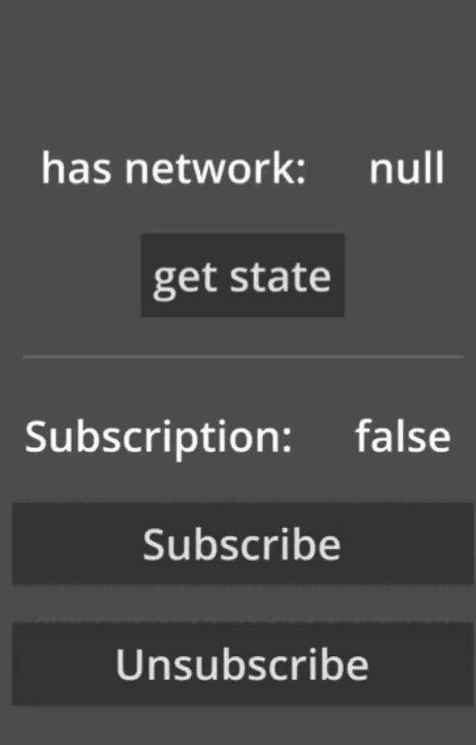

<p align="center">
  
</p>

<h1 align="center">
  Godot Internet Connection State Plugin
</h1>

## About

The plugin provides you with the ability to check whether the Android user is connected to the Internet or not (the plugin checks for Wi-Fi, cellular and Ethernet connections) and real-time state or network type change.

Special thanks to the YouTube channel “Coding With Nothing”.


## Example preview

<div align="center">
  
</div>


## Features

- On-demand network state/type check
- Real-time network state/type change monitoring


## Requirements 

- Godot 4.2 or higher
- Android 7.0 or higher
  - Use Gradle build
  - Enable Access Network State permissions
  - Enable Access Wi-Fi State permissions


## Installation

- Open the `AssetLib` tab in Godot with your project open.
- Search for "Android Internet Connection State Plugin" and install the plugin by Mero.
- Once the download completes, deselect "example" if you don't need the demo test scene.
- Open project settings -> plugins, and enable the plugin "AndroidInternetConnectionStatePlugin".
- Done!


## Usage

> Note: don't forget to check "Requirements" section.

> You may find usage as autoload example in "example" folder

- add `AndroidNetworkState.gd` from plugins folder to globals (autoload) at Project -> Project Settings -> Globals (autoload) 
or instantiate `AndroidNetworkState`
```
var netState: AndroidNetworkState = AndroidNetworkState.new()
```


### Methods

- `hasNetwork` - return current network connections state as bool (for any of: WIFI, cellular or Ethernet)
- `hasWIFI` - same as `hasNetwork` but checks only for WIFI
- `hasCellular` - same as `hasNetwork` but checks only for cellular
- `hasEthernet` - same as `hasNetwork` but checks only for Ethernet
- `getActiveNetworkType` - return current connected network name ("WIFI" | "CELLULAR" | "ETHERNET") or "NONE"


### Signals

- `stateChanged(curState: bool)` - emitting on network connection change
- `networkTypeChanged(networkType: String)` - emitting on network type change


## Example

> Note: don't forget to check "Requirements" & "Usage" sections.

- Install the plugin and leave "example" folder as selected
- Set the "example/test.tscn" scene as main in your project
- Install Android build templates
- Export project for Android and run the app on your Android device or use remote deploy

> If you have already installed the plugin without the "example" folder, you can download it from the current repository and place it in your project, all other steps remain the same or remove the project folder from your project and install it again with checked example folder.


## Warning

The plugin itself cannot determine whether the user has **Internet access** or not! It can only check the connection status.
> For example: if the user is connected to Wi-Fi but does not have actual Internet access, in this case the plugin will return the connection status as **true**.


## Extra

You can find implementation assets of the plugin in the Android Studio Assets folder, feel free to explore. 
