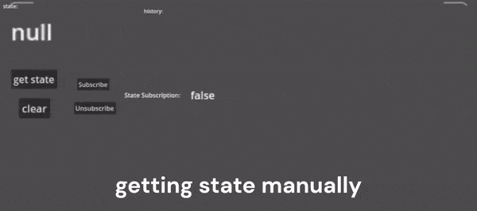

<p align="center">
  
</p>

<h1 align="center">
  Godot Internet Connection State Plugin
</h1>

## About

The plugin provides you with the ability to check whether the Android user is connected to the Internet or not (the plugin checks both Wi-Fi and cellular connections) and real-time state handling.

Special thanks to the YouTube channel “Coding With Nothing”.


## Features

- On-demand check
- Real-time observing (signal connection)


## Requirements 

- Godot 4.2 or higher
- Android 7.0 or higher
  - Use Gradle build
  - Enable Access Network State permissions
  - Enable Access Wi-Fi State permissions


## Installation

- Open the `AssetLib` tab in Godot with your project open.
- Search for "Android Internet Connection State Plugin" and install the plugin by Mero.
- Once the download completes, deselect "example" if you don't need the demo test scene.
- Open project settings -> plugins, and enable the plugin "AndroidInternetConnectionStatePlugin".
- Done!


## Usage
  
> Note: the plugin registers itself as *Autoload* under the name "AndroidInternetConnectionStatePlugin".

> Note: don't forget to check "Requirements" section.

1. Install the plugin
2. Enable the plugin in Godot (Project -> Project Settings -> Plugins Tab)
3. Obtain the plugin instance:
```
var _AndroidInternetConnectionStatePlugin = Engine.get_singleton("AndroidInternetConnectionStatePlugin")
```
4. Check connection:

    4.1 On-demand check by calling `isNetworkConnected` method:
    ```
    # return bool (true if connected, otherwise - false)
    _AndroidInternetConnectionStatePlugin.isNetworkConnected()
    ```
    4.2 Real-time check by connection to "hasNetwork" signal:
    ```
    _AndroidInternetConnectionStatePlugin.connect("hasNetwork", _onInternetConnectionStateChange)

    func _onInternetConnectionStateChange(data):
      # add print to console etc.
      pass
    ```


## Demo

> Note: don't forget to check "Requirements" & "Usage" sections.

- Install the plugin and leave "example" folder as selected
- Set the "example/test.tscn" scene as main in your project
- Install Android build templates
- Export project for Android
- Run the app on your Android device

> If you have already installed the plugin without the "example" folder, just download it from the current repository and place it in your project, all other steps remain the same.


## Demo Preview




## Warning

The plugin itself cannot determine whether the user has **Internet access** or not! It can only check the connection status.
> For example: if the user is connected to Wi-Fi but does not have actual Internet access, in this case the plugin will return the connection status as **true**.


## Extra

You can find implementation assets of the plugin in the Android Studio Assets folder, feel free to explore. 
